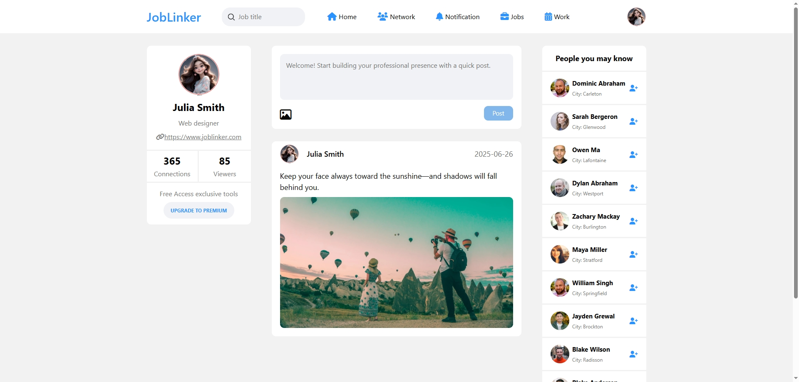

# JobLinker

This is a job search website template designed to help users connect, find job opportunities, and expand their professional networks.

## Features

- **User Profiles:** View detailed user profiles to learn more about potential connections.
- **Community Information:** Access community updates and shared resources.
- **People You May Know:** Discover and add people to expand your professional network.
- **Job Search:** Search for job postings from various companies.
- **Multiple Modules:** View and manage notifications, work information, text messages, schedules, and more.
- **Posting:** Users can post various types of content to the community, including status updates, job-seeking information, and job recruitment posts.

## Usage

Users can browse different modules to stay updated, connect with professionals, and find or post job opportunities and other relevant information easily.

## Main page

## The technologies used to build the web app
- **Front-end**
  - HTML (HyperText Markup Language)
  - CSS (Cascading Style Sheets)
  - JavaScript
- **Version Control**
  - GitHub
- **Hosting and Deployment**
  - Netlify